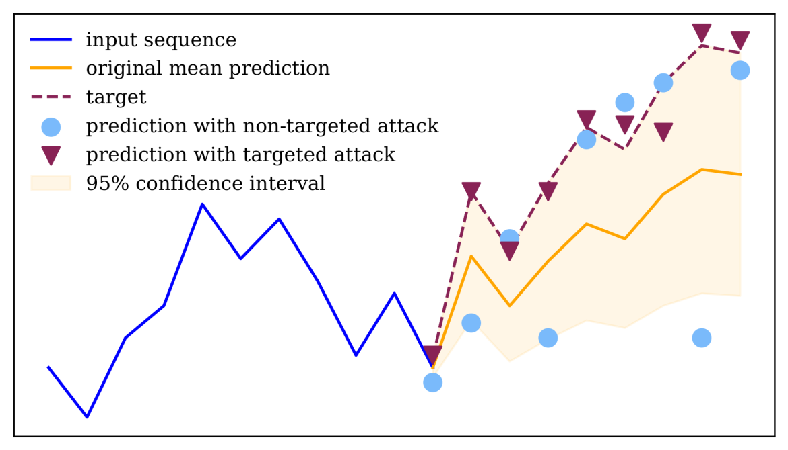

# -Internship-Adversarial-time-series


Adversarial Machine Learning is a field of Machine Learning that focuses on exploiting model vulnerabilities by making use of obtainable information from the model. Studying a model’s weaknesses to adversarial attacks not only helps the researcher understand more about the model itself, but also allows them to defend against malicious attacks and prevent potentially fatal consequences after deployment. Adversarial Machine Learning was firstly proposed in the image classification domain, where an attack fools a model to misclassify an image by adding carefully crafted noise that is hardly detectable by a human. Recently, adversarial methods have been introduced that target time series challenges. We will develop and evaluate new adversarial attacks on time series, targeting specific time series challenges beyond forecasting.

https://wickerlab.org/join-us/adversarial-time-series/

# FOR THE MOMENT
main.ipynb = light notebook with facto code
adversial_attack.ipynb = all in one notebook

# Requirements

To run this project and reproduce the results, please follow these steps carefully:

## Download the datasets
Due to size restrictions on GitHub, the CSV files are not included in this repo. You must download them yourself:

    GlobalLandTemperaturesByCity.csv (approx. 500 MB)
    Download from Kaggle:
    https://www.kaggle.com/datasets/berkeleyearth/climate-change-earth-surface-temperature-data?resource=download&select=GlobalLandTemperaturesByCity.csv

    Google Stock Data (last 5 years)
    Download historical stock data (CSV) for Google from Nasdaq:
    https://www.nasdaq.com/market-activity/stocks/goog/historical

Place these CSV files directly in the root of the cloned repo, or update the path in the notebook accordingly.


### Option 1: Run on Google Colab

- Simply open the notebook on Google Colab and run it no setup required.

### Option 2: Run Locally

### 1. Clone the repository

```bash
git clone https://github.com/Samy-Annasri/Internship-Adversarial-time-series.git
cd Internship-Adversarial-time-series
```

### 2. Install Python dependencies
This project requires Python 3.8+ and the following packages:

* pandas

* numpy

* torch (PyTorch)

* matplotlib

* scikit-learn

* ipython (for notebook display)

You can install them with pip:
```bash
pip install -r requirements.txt
```

### 3. Run the Jupyter notebook

Open the provided notebook (.ipynb) with Jupyter:
```bash
jupyter notebook
```
Load the notebook and make sure the CSV filenames in the notebook match exactly the downloaded files.
